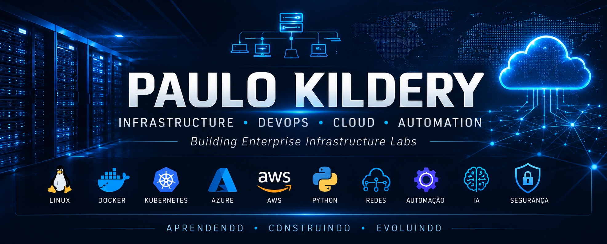

  

 

<h1 align="center">Olá, eu sou Paulo Kildery — PK 👋</h1>

<h3 align="center">
  Infraestrutura e Redes | DevOps | Cloud | Automação | Cibersegurança
</h3>

  Profissional de Tecnologia da Informação com experiência em infraestrutura,
  redes corporativas, servidores Windows e Linux, segurança, monitoramento
  e sustentação de serviços críticos.

  Atualmente, estou ampliando minha atuação em DevOps, Cloud, automação,
  desenvolvimento Full Stack e Inteligência Artificial aplicada.

  
  

---

## 👨‍💻 Sobre mim

- Experiência em infraestrutura, redes e segurança da informação.
- Administração de ambientes Windows Server e Linux.
- Atuação com Active Directory, DNS, DHCP, virtualização e monitoramento.
- Experiência com switches, VLANs, firewalls e conectividade corporativa.
- Prática com Zabbix, NetBox, OCS Inventory, pfSense e OPNsense.
- Formação e laboratórios em DevOps, Cloud, Python e desenvolvimento Full Stack.
- Interesse profissional em Infraestrutura Moderna, DevOps, Cloud e automação.

---

## 🧰 Tecnologias com experiência prática

### Infraestrutura, redes e sistemas

  
  
  
  
  
  

### Monitoramento e gestão de infraestrutura

  
  
  
  
  

---

## 🚀 Tecnologias em desenvolvimento

  
  
  
  
  
  
  
  
  

> As tecnologias desta seção fazem parte da minha formação atual e dos
> laboratórios que estou documentando no GitHub.

---

## 🎓 Certificações

  
  

- Microsoft Certified: Azure Fundamentals — AZ-900.
- Microsoft Certified: Security, Compliance, and Identity Fundamentals — SC-900.
- Em preparação: AI-900, AZ-104 e AZ-500.

---

## 📂 Projetos em destaque

### Infrastructure Labs

Repositório destinado à documentação de laboratórios em infraestrutura,
Git, DevOps, Cloud, automação e desenvolvimento.

Principais temas:

- Git e GitHub.
- Linux e Windows Server.
- Redes e segurança.
- Docker e Kubernetes.
- Azure e AWS.
- Python e automação.
- Monitoramento e observabilidade.

---

## 📊 Atividade no GitHub

- Desenvolvimento contínuo do projeto **Infrastructure Labs**.
- Laboratórios documentados com Git e GitHub.
- Prática com branches, merges, resolução de conflitos e rebase.
- Evolução planejada para Linux, Docker, Kubernetes, Python, Azure e automação.

  

---

  Construindo laboratórios, documentando soluções e evoluindo continuamente.

